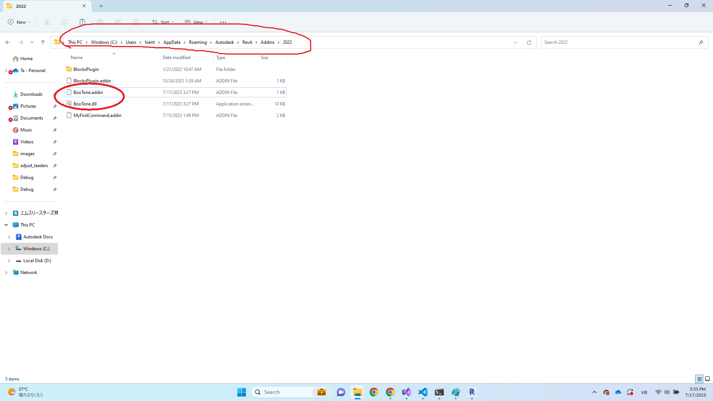

# Boo Tone

## Install BooTone add-ins
### Step 1: Download BooTone
- Clone code
```
$ git clone https://github.com/BIMwork/RD_Revit.git
```

### Step 2: Install BooTone in Revit2022
- Copy file BooTone.dll and BooTone.addin in fodler **C:\Users\hient\AppData\Roaming\Autodesk\Revit\Addins\2022**


