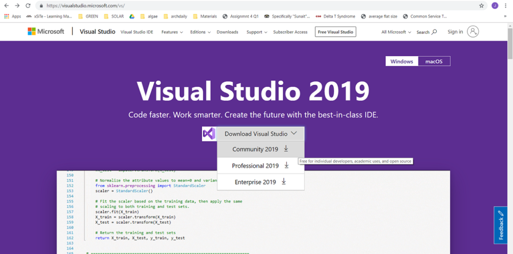
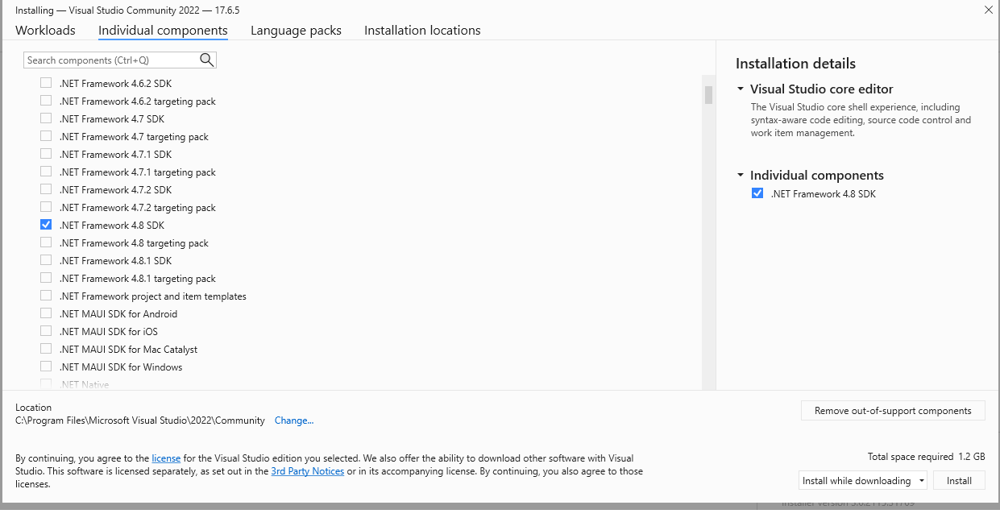
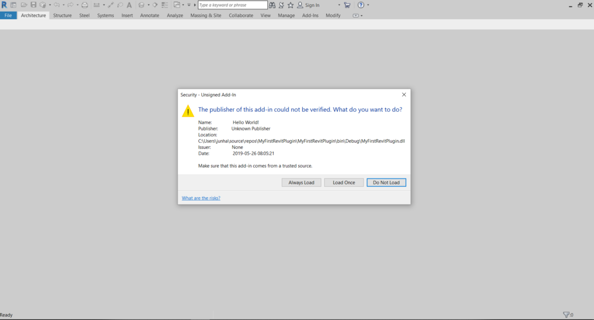
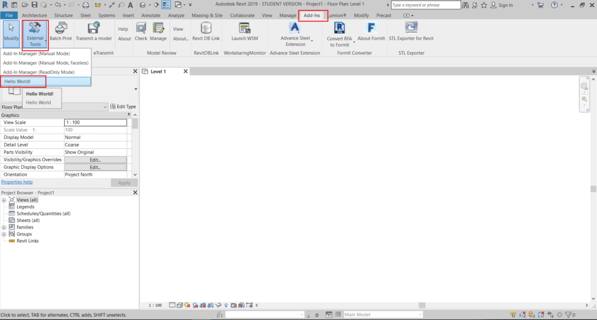
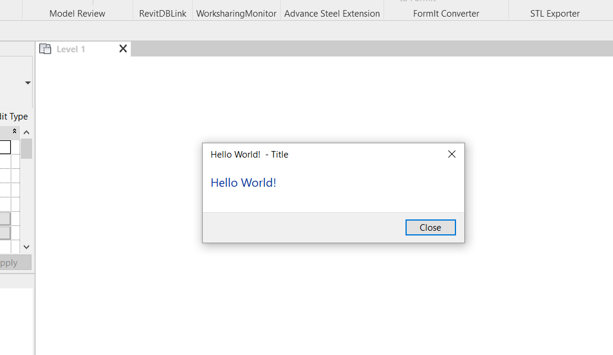

# Step-by-Step Guide to Developing your First Revit Plugin

## Prerequirement
- Visual Studio 2022
- Revit 2022

## Step-by-Step 
### 1. Download Visual Studio
- Link: https://visualstudio.microsoft.com/fr/



### Configure Visual Studio installation
- Revit and .Net version
```
Revit 2014 : NET 4.0
Revit 2015 / 2016 / 2017 : NET 4.5
Revit 2018 : NET 4.5.2
Revit 2019 : NET 4.7
Revit 2022 : NET 4.8
```



### 3. Create a new project
```
Run Visual Studio Community 2022 → File → New → Project → Class Library (.NET Framework)
```
http://aectechy.com/wp-content/uploads/2019/06/Step3_CreateNew.mp4

### 4. Add References
```
Right click “References“ under Solution Explorer → Add Reference → Browse → “C:\Program Files\Autodesk\Revit 2019 “ → Add “RevitAPI” & “RevitAPIUI” → Select “RevitAPI“ & “RevitAPIUI“ → Properties → Copy Local → False
```
http://aectechy.com/wp-content/uploads/2019/06/Step4_AddRef-1.mp4

### 5. Add Namespaces
- Import libs
```
using Autodesk.Revit.Attributes;
using Autodesk.Revit.DB;
using Autodesk.Revit.UI;
```
http://aectechy.com/wp-content/uploads/2019/06/Step5_Using.mp4

### 6. Implement IExternalCommand
```
Hover over IExternal Command → Implement interface
```
http://aectechy.com/wp-content/uploads/2019/06/Step6_IExternalCmd.mp4

### 7. Execute Method
http://aectechy.com/wp-content/uploads/2019/06/Step7_ExecuteTrans.mp4

### 8. The classic "Hello World!"
- Your final code should look similar or identical to this:
```
using Autodesk.Revit.Attributes;
using Autodesk.Revit.DB;
using Autodesk.Revit.UI;
 
namespace MyFirstRevitPlugin
{
    [TransactionAttribute(TransactionMode.Manual)]
    public class Class1 : IExternalCommand
    {
        public Result Execute(ExternalCommandData commandData, ref string message, ElementSet elements)
        {
            TaskDialog.Show("Title", "Hello World!");
 
            return Result.Succeeded;
        }
    }
}
```
http://aectechy.com/wp-content/uploads/2019/06/Step8_HelloWorld.mp4

### 9. Build your solution file
```
Build → Build Solution
```

### 10. Create ".Addin" file
- The Manifest or .Addin file consists of parameters required to setup the Revit plugin that we built.
```
Right click “MyFirstRevitPlugin” file → Add → New item → Application Manifest File → File name “MyFirstRevitPlugin.addin”
```
http://aectechy.com/wp-content/uploads/2019/06/Step10_NewAddin.mp4

### 11. Configure ".Addin" file & Re-build
- You should see a bunch of confusing words, but don’t worry. Simply wipe them out, and replace them with the xml code below.
```
<?xml version="1.0" encoding="utf-8"?>
<RevitAddIns>
  <AddIn Type="Command">
    <Name>MyFirstRevitPlugin</Name>
    <FullClassName>MyFirstRevitPlugin.Class1</FullClassName>
    <Text> Hello World Text </Text>
    <Description> Hello World Description</Description>
    <VisibilityMode>AlwaysVisible</VisibilityMode>
    <Assembly>
      C:\Users\junha\source\repos\MyFirstRevitPlugin\MyFirstRevitPlugin\bin\Debug\MyFirstRevitPlugin.dll
    </Assembly>
    <AddInId>502fe383-2648-4e98-adf8-5e6047f9dc34</AddInId>
    <VendorId>AECTechy</VendorId>
    <VendorDescription>AECTechy</VendorDescription>
  </AddIn>
</RevitAddIns>
```
- **Replace the <Assembly> portion with your directory output from Step 9.** This will allow Revit to read your application directly from that directory. Set “Copy to Output Directory” property of the .Addin file to "Copy if newer". This option tells Visual Studio to construct the latest .Addin file to the output directory.

http://aectechy.com/wp-content/uploads/2019/06/Step11_AddinConfig.mp4

### 12. Copy addin file to Revit addin directory
- Finally, we have to tell Revit to read the manifest (.Addin) file when we fire up Revit. Revit reads manifest files from two directories, if you installed Revit with default folder location, the directories should be:

- All users
  - C:\Program Files\Autodesk\Revit 2022\AddIns
- Individual user
  - C:\Users\<Your User Name>\AppData\Roaming\Autodesk\Revit\Addins\2022

- I don’t wanna mess with other user’s settings, so I shall go with the second option. Go to your solution file’s debug folder, copy the manifest file to the Revit’s addin directory. That’s it, you’re ready to run your plugin!
```
Go to directory from Step 9 → Copy “MyFirstRevitPlugin.addin”
→ Paste into ” C:\Users\<Your User Name>\AppData\Roaming\Autodesk\Revit\Addins\2022″
```
http://aectechy.com/wp-content/uploads/2019/06/Step12_AddinDir.mp4

### 13. Run your first addin
Congrats! You’ve completed your first Revit addin!
```
Run Revit 2022 → Load the Addin → Add-ins tab→ External tools → Run "Hello World!"
```






# Refs
- https://visualstudio.microsoft.com/fr/